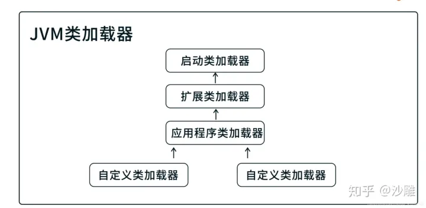

JVM为什么会抛出ClassNotFund异常？在抛出这个异常的时候JVM的类加载器做了什么工作？

Java程序在执行的过程中，是先执行父类还是先执行子类。如果加载父类，那么父类还有父类呢，这个时候JVM还要怎么处理，

JVM是如何保证类加载的有序性和安全性？

## 类加载器的分类

### 分类

每个类加载器的作用
启动类加载器：负责加载Java_HOME目录下，lib的目录下的类库。

扩展类加载器：负责加载Java_HOME目录下，lib子目录下的ext的子目录的类库

应用程序类加载器：加载用户路径classpath上的类库。

自定义类加载器：通过继承 java.lang.ClassLoader，根据不同的需求来实现自定义的类加载器。然而在实际开发中，我们必然是要继承JDK中的类或者实现JDK中的接口。

## 解决方法：双亲委派

### 向上委派

一个类在收到类加载请求后，不会自己加载这个类，而是把这个类加载请求向上委派给它的父类去完成，父类收到这个请求后又继续向上委派给自己的父类，以此类推，直到所有的请求委派到启动类加载器中。

tips： 这让双亲委派机制保证类加载的顺序性。

第一步： 将自定义加载器挂载到应用程序类加载器 第二步： 应用程序类加载器将请求委托给扩展类加载器 第三步： 扩展类加载器将请求委托给启动类加载器

### 向下委派

当父类加载器在接收到类加载请求后，发现自己也无法加载这个类（这个情况通常是因为这个类的Class文件在父类的加载路径中不存在）这时父类会把这个信息反馈给子类，并向下委派子类加载器来加载这个类，直到这个请求被成功加载，但是一直到自定义加载器都没有找到，JVM就会抛出ClassNotFund异常。

**向下委派的加载过程（报ClassNotFund的过程）**

第一步： 启动类在加载路径下查找并加载Class文件，如果没有找到就交给扩展类加载器加载 第二步：扩展类加载器在它的加载路径下查找并加载Class文件，如果还是没有找到，再交给应用程序类加载器加载 第三步：应用程序类加载器在加载路径下查找并加载Class文件，如果还是没有找到，就交给自定义加载器进行加载 第四步：自定义加载器在用户指定的位置进行查找并加载Class文件，如果还是没有找到，JVM抛出ClassNotFund异常。这时类加载失败，JVM也启动失败。

双亲委派的核心：保证类的安全性和唯一性

总结

