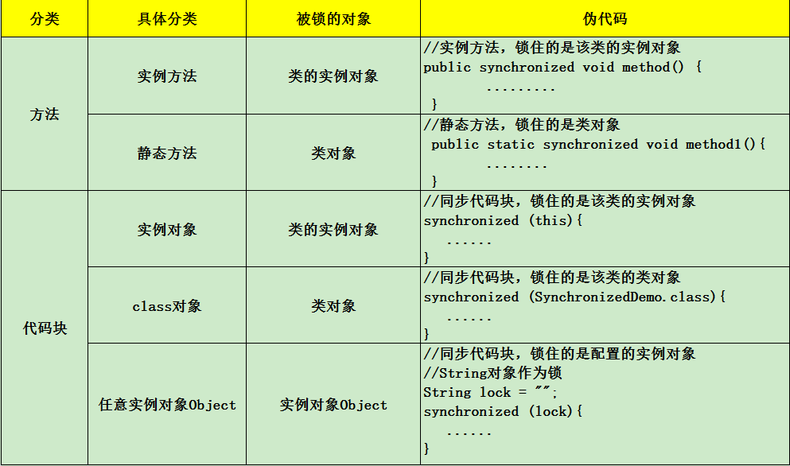
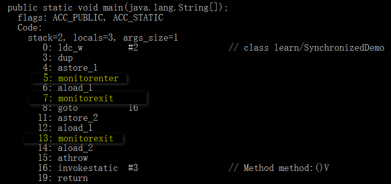
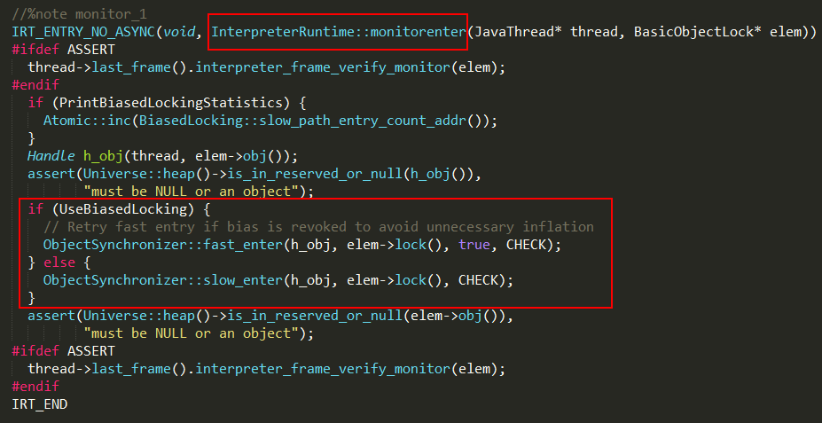
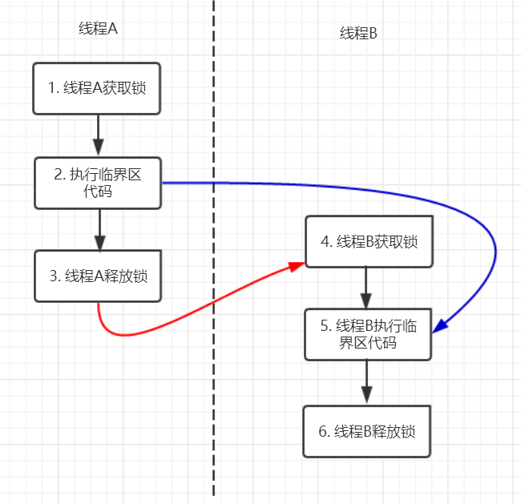

### 简介

Java并发编程这个领域中synchronized关键字一直都是元老级的角色，很久之前很多人都会称它为“重量级锁”。但是，在JavaSE 1.6之后进行了主要包括为了减少获得锁和释放锁带来的性能消耗而引入的偏向锁和轻量级锁以及其它各种优化之后变得在某些情况下并不是那么重了。

### 变量安全性

“非线程安全”问题存在于“实例变量”中，如果是方法内部的私有变量，则不存在“非线程安全”问题，所得结果也就是“线程安全”的了。如果两个线程同时操作对象中的实例变量，则会出现“非线程安全”，解决办法就是在方法前加上synchronized关键字即可。

### Synchronized的使用

```shell
/**
 * 同步线程
 */
class SyncThread implements Runnable {
   private static int count;
 
   public SyncThread() {
      count = 0;
   }
 
   public  void run() {
      synchronized(this) {
         for (int i = 0; i < 5; i++) {
            try {
               System.out.println(Thread.currentThread().getName() + ":" + (count++));
               Thread.sleep(100);
            } catch (InterruptedException e) {
               e.printStackTrace();
            }
         }
      }
   }
 
   public int getCount() {
      return count;
   }
}
//SyncThread的调用：
SyncThread syncThread = new SyncThread();
Thread thread1 = new Thread(syncThread, "SyncThread1");
Thread thread2 = new Thread(syncThread, "SyncThread2");
thread1.start();
thread2.start();

//结果如下：

SyncThread1:0
SyncThread1:1
SyncThread1:2
SyncThread1:3
SyncThread1:4
SyncThread2:5
SyncThread2:6
SyncThread2:7
SyncThread2:8
SyncThread2:9
```

当两个并发线程(thread1和thread2)访问同一个对象(syncThread)中的synchronized代码块时，在同一时刻只能有一个线程得到执行，另一个线程受阻塞，必须等待当前线程执行完这个代码块以后才能执行该代码块。Thread1和thread2是互斥的，因为在执行synchronized代码块时会锁定当前的对象，只有执行完该代码块才能释放该对象锁，下一个线程才能执行并锁定该对象。 我们再把SyncThread的调用稍微改一下：

```shell
Thread thread1 = new Thread(new SyncThread(), "SyncThread1");
Thread thread2 = new Thread(new SyncThread(), "SyncThread2");
thread1.start();
thread2.start();
```

结果如下：

```shell
SyncThread1:0
SyncThread2:1
SyncThread1:2
SyncThread2:3
SyncThread1:4
SyncThread2:5
SyncThread2:6
SyncThread1:7
SyncThread1:8
SyncThread2:9
```

不是说一个线程执行synchronized代码块时其它的线程受阻塞吗？为什么上面的例子中thread1和thread2同时在执行。这是因为synchronized只锁定对象，每个对象只有一个锁（lock）与之相关联，而上面的代码等同于下面这段代码：

```shell
SyncThread syncThread1 = new SyncThread();
SyncThread syncThread2 = new SyncThread();
Thread thread1 = new Thread(syncThread1, "SyncThread1");
Thread thread2 = new Thread(syncThread2, "SyncThread2");
thread1.start();
thread2.start();
```

这时创建了两个SyncThread的对象syncThread1和syncThread2，线程thread1执行的是syncThread1对象中的synchronized代码(run)，而线程thread2执行的是syncThread2对象中的synchronized代码(run)；我们知道synchronized锁定的是对象，这时会有两把锁分别锁定syncThread1对象和syncThread2对象，而这两把锁是互不干扰的，不形成互斥，所以两个线程可以同时执行。

***修饰一个方法*** Synchronized修饰一个方法很简单，就是在方法的前面加synchronized，public synchronized void method(){//todo}; synchronized修饰方法和修饰一个代码块类似，只是作用范围不一样，修饰代码块是大括号括起来的范围，而修饰方法范围是整个函数。

```shell
public synchronized void run() {
   for (int i = 0; i < 5; i ++) {
      try {
         System.out.println(Thread.currentThread().getName() + ":" + (count++));
         Thread.sleep(100);
      } catch (InterruptedException e) {
         e.printStackTrace();
      }
   }
```

修饰一个静态的方法 Synchronized也可修饰一个静态方法，用法如下：

```java
public synchronized static void method() {
   // todo
}
```

我们知道静态方法是属于类的而不属于对象的。同样的，synchronized修饰的静态方法锁定的是这个类的所有对象.

修饰一个类 Synchronized还可作用于一个类，用法如下：

```java
class ClassName {
   public void method() {
      synchronized(ClassName.class) {
         // todo
      }
   }
}
```

总结：



无论synchronized关键字加在方法上还是对象上，如果它作用的对象是非静态的，则它取得的锁是对象；如果synchronized作用的对象是一个静态方法或一个类，则它取得的锁是对类，该类所有的对象同一把锁。 B. 每个对象只有一个锁（lock）与之相关联，谁拿到这个锁谁就可以运行它所控制的那段代码。 C. 实现同步是要很大的系统开销作为代价的，甚至可能造成死锁，所以尽量避免无谓的同步控制。

### Synchronized的原理

对象锁（monitor）机制
现在我们来看看synchronized的具体底层实现。先写一个简单的demo:

```java
public class SynchronizedDemo {
    public static void main(String[] args) {
        synchronized (SynchronizedDemo.class) {
        }
        method();
    }
    private static void method() {
    }
}
```

上面的代码中有一个同步代码块，锁住的是类对象，并且还有一个同步静态方法，锁住的依然是该类的类对象。编译之后，切换到SynchronizedDemo.class的同级目录之后，然后用javap -v SynchronizedDemo.class查看字节码文件:



synchronized关键字基于上述两个指令实现了锁的获取和释放过程，解释器执行monitorenter时会进入到InterpreterRuntime.cpp的InterpreterRuntime::monitorenter函数，具体实现如下：



执行同步代码块后首先要先执行monitorenter指令，退出的时候monitorexit指令。通过分析之后可以看出，使用Synchronized进行同步，其关键就是必须要对对象的监视器monitor进行获取，当线程获取monitor后才能继续往下执行，否则就只能等待。而这个获取的过程是互斥的，即同一时刻只有一个线程能够获取到monitor。上面的demo中在执行完同步代码块之后紧接着再会去执行一个静态同步方法，而这个方法锁的对象依然就这个类对象，那么这个正在执行的线程还需要获取该锁吗？答案是不必的，从上图中就可以看出来，执行静态同步方法的时候就只有一条monitorexit指令，并没有monitorenter获取锁的指令。这就是锁的重入性，即在同一锁程中，线程不需要再次获取同一把锁。Synchronized先天具有重入性。每个对象拥有一个计数器，当线程获取该对象锁后，计数器就会加一，释放锁后就会将计数器减一。

***synchronized的happens-before关系***

什么是happens-before

概念 happens-before的概念最初由Leslie Lamport在其一篇影响深远的论文（《Time，Clocks and the Ordering of Events in a Distributed System》）中提出，有兴趣的可以google一下。JSR-133使用happens-before的概念来指定两个操作之间的执行顺序。由于这两个操作可以在一个线程之内，也可以是在不同线程之间。 因此，JMM可以通过happens-before关系向程序员提供跨线程的内存可见性保证（如果A线程的写操作a与B线程的读操作b之间存在happens-before关系，尽管a操作和b操作在不同的线程中执行，但JMM向程序员保证a操作将对b操作可见）。具体的定义为： 1）如果一个操作happens-before另一个操作，那么第一个操作的执行结果将对第二个操作可见，而且第一个操作的执行顺序排在第二个操作之前。 2）两个操作之间存在happens-before关系，并不意味着Java平台的具体实现必须要按照happens-before关系指定的顺序来执行。如果重排序之后的执行结果，与按happens-before关系来执行的结果一致，那么这种重排序并不非法（也就是说，JMM允许这种重排序）。 上面的1）是JMM对程序员的承诺。从程序员的角度来说，可以这样理解happens-before关系：如果A happens-before B，那么Java内存模型将向程序员保证——A操作的结果将对B可见，且A的执行顺序排在B之前。注意，这只是Java内存模型向程序员做出的保证！ 上面的2）是JMM对编译器和处理器重排序的约束原则。正如前面所言，JMM其实是在遵循一个基本原则：只要不改变程序的执行结果（指的是单线程程序和正确同步的多线程程序），编译器和处理器怎么优化都行。JMM这么做的原因是：程序员对于这两个操作是否真的被重排序并不关心，程序员关心的是程序执行时的语义不能被改变（即执行结果不能被改变）。因此，happens-before关系本质上和as-if-serial语义是一回事。

具体规则如下：

1.程序顺序规则：一个线程中的每个操作，happens-before于该线程中的任意后续操作。

2.监视器锁规则：对一个锁的解锁，happens-before于随后对这个锁的加锁。

3.volatile变量规则：对一个volatile域的写，happens-before于任意后续对这个volatile域的读。

4.传递性：如果A happens-before B，且B happens-before C，那么A happens-before C。

5.start()规则：如果线程A执行操作ThreadB.start()（启动线程B），那么A线程的ThreadB.start()操作happens-before于线程B中的任意操作。

6.join()规则：如果线程A执行操作ThreadB.join()并成功返回，那么线程B中的任意操作happens-before于线程A从ThreadB.join()操作成功返回。

7.程序中断规则：对线程interrupted()方法的调用先行于被中断线程的代码检测到中断时间的发生。

8.对象finalize规则：一个对象的初始化完成（构造函数执行结束）先行于发生它的finalize()方法的开始。

Synchronized的happens-before规则，即监视器锁规则：对同一个监视器的解锁，happens-before于对该监视器的加锁。继续来看代码：

```shell
public class MonitorDemo {
    private int a = 0;

    public synchronized void writer() {     // 1
        a++;                                // 2
    }                                       // 3

    public synchronized void reader() {    // 4
        int i = a;                         // 5
    }                                      // 6
}
```

该代码的happens-before关系如图所示：



在图中每一个箭头连接的两个节点就代表之间的happens-before关系，黑色的是通过程序顺序规则推导出来，红色的为监视器锁规则推导而出：线程A释放锁happens-before线程B加锁，蓝色的则是通过程序顺序规则和监视器锁规则推测出来happens-befor关系，通过传递性规则进一步推导的happens-before关系。现在我们来重点关注2 happens-before 5，通过这个关系我们可以得出什么？

根据happens-before的定义中的一条:如果A happens-before B，则A的执行结果对B可见，并且A的执行顺序先于B。线程A先对共享变量A进行加一，由2 happens-before 5关系可知线程A的执行结果对线程B可见即线程B所读取到的a的值为1。

synchronized的优化

通过上面的讨论现在我们对Synchronized应该有所印象了，它最大的特征就是在同一时刻只有一个线程能够获得对象的监视器（monitor），从而进入到同步代码块或者同步方法之中，即表现为互斥性（排它性）。这种方式肯定效率低下，每次只能通过一个线程，既然每次只能通过一个，这种形式不能改变的话，那么我们能不能让每次通过的速度变快一点了。打个比方，去收银台付款，之前的方式是，大家都去排队，然后去纸币付款收银员找零，有的时候付款的时候在包里拿出钱包再去拿出钱，这个过程是比较耗时的，然后，支付宝解放了大家去钱包找钱的过程，现在只需要扫描下就可以完成付款了，也省去了收银员跟你找零的时间的了。同样是需要排队，但整个付款的时间大大缩短，是不是整体的效率变高速率变快了？这种优化方式同样可以引申到锁优化上，缩短获取锁的时间。
