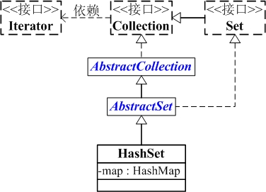

### **Java高级特性增强-集合框架(HashSet)**

#### **多线程**

### **集合框架**

### **NIO**

### **Java并发容器**


## 集合框架

#### Java中的集合框架

ArrayList/Vector
LinkedList
HashMap
HashSet
LinkedHashMap
...

#### HashSet

##### HashSet简介

HashSet 是一个不允许存储重复元素的集合，它的实现比较简单，只要理解了 HashMap，HashSet就水到渠成了。



从图中可以看出：

1. HashSet继承于AbstractSet，并且实现了Set接口。
2. HashSet的本质是一个"没有重复元素"的集合，它是通过HashMap实现的。HashSet中含有一个"HashMap类型的成员变量"map，HashSet的操作函数，实际上都是通过map实现的。

##### 成员变量

首先了解下 HashSet 的成员变量:

```java
 private transient HashMap<E,Object> map;

    // Dummy value to associate with an Object in the backing Map
    private static final Object PRESENT = new Object();
```

发现主要就两个变量:

map: 用于存放最终数据的。
PRESENT: 是所有写入 map 的 value 值。

##### 构造函数

```java
    public HashSet() {
        map = new HashMap<>();
    }

    public HashSet(int initialCapacity, float loadFactor) {
        map = new HashMap<>(initialCapacity, loadFactor);
    }  
```

构造函数很简单，利用了HashMap初始化了map。

**add**

```java
public boolean add(E e) {
        return map.put(e, PRESENT)==null;
    }
```

比较关键的就是这个add()方法。可以看出它是将存放的对象当做了HashMap 的健,value都是相同的PRESENT。由于HashMap的key是不能重复的,所以每当有重复的值写入到HashSet时,value会被覆盖,但key不会受到影响,这样就保证了HashSet中只能存放不重复的元素。
HashSet的原理比较简单,几乎全部借助于HashMap来实现的。
